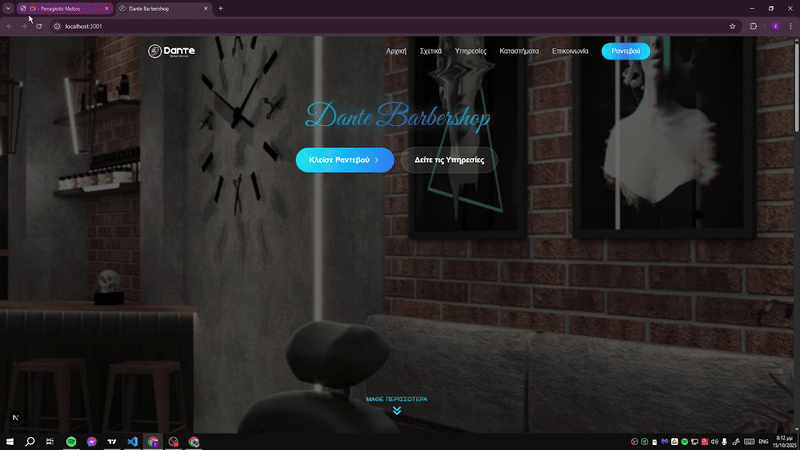

# 💈 Dante Barbershop — Modern Next.js Website

A modern, fully responsive **barbershop website** built with **Next.js**, **TypeScript**, and **Tailwind CSS**.  
It includes smooth animations, scroll effects, and a booking button integration (Fresha ready).

---

## 🚀 Demo

🎥 **Video Preview:**  



Or view it live here:  
👉 https://your-demo-link.vercel.app

---

## 🧩 Features

- ⚡ Built with **Next.js 14 + TypeScript**
- 🎨 Styled using **Tailwind CSS**
- ✨ Smooth animations (fade, bounce, appear)
- 📱 Fully responsive (mobile-first)
- 💬 Greek language content (multi-section layout)
- 📍 Location links to Google Maps
- 🔗 Social media integration (Facebook, Instagram, TikTok)
- 📅 Booking CTA ready for **Fresha** integration

---

## 🧠 Tech Stack

| Technology | Description |
|-------------|--------------|
| **Next.js** | React framework for server-side rendering |
| **Tailwind CSS** | Utility-first CSS framework |
| **TypeScript** | Type-safe JavaScript |
| **Lucide Icons** | Modern SVG icon library |
| **Lottie** | Animated vector icons (used for barber icon animation) |

---

## 🧰 Installation & Setup

```bash
# Clone the repository
git clone https://github.com/YOUR_USERNAME/dante-barbershop.git

# Navigate into the project
cd dante-barbershop

# Install dependencies
npm install

# Run the development server
npm run dev
